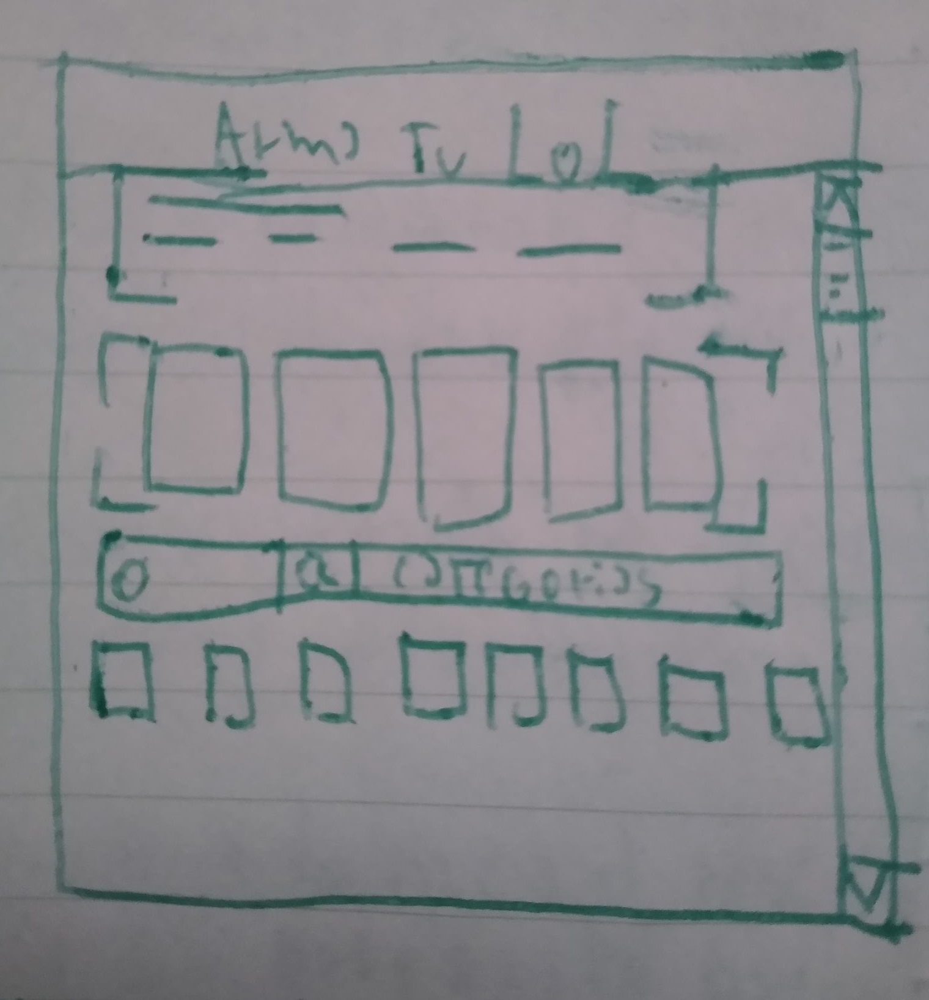

# Introducción

League of Legends es un videojuego masivo de la categoría MOBA (arena de batalla multijugador en linea) que en año 2014 tuvo un total de 67 millones de jugadores al mes, lo que le permitió tomar el record de mayor cantidad de jugadores en el mundo. Para el año 2020, si bien sus números han bajado ligeramente, cuenta con una comunidad activa estimada en 115 millones según el sitio [Ranked Kings] (https://rankedkings.com/blog/how-many-people-play-league-of-legends)

# Definición de usuario

League of Legends nace el 27 de octubre 2009 y en sus 11 años de trayectoria solo ha crecido en cantidad de jugadores. Al ser un juego más viejo que otros (como lo es el popular juego Fortnite), muchos de sus usuarios han envejecido con el mismo juego. Estableciendo un margen etareo de entre 18 a 30 años de edad, se puede apreciar que la mayoría de los usuarios corresponden a jugadores no tan competitivos que están en rangos más bajos de la escala como se puede apreciar en el gráfico del sitio Esports Tales

Esto pone en evidencia la carencia de los usuarios por dominar toda la información referente al juego. La aplicación de ArmaTuLol viene a solventar esta carencia cubriendo la información sobre los campeones, sus roles y sus estadísticas. 

## Historia de usuario

* Usuario n°1 

 - El usuario juega de forma casual el juego y desea poder armar combinaciones de campeones para armar un equipo para jugar.
 - El usuario conoce poco del juego y desea poder filtrar por roles a los campeones y ver información de los mismos para poder armar su equipo.
  * Definición de Hecho:
 -  Al entrar se encuentra con un listado de campeones y la opción de poder filtrarlos por su tipo (luchador, tirador, mago o hechicero, Asesino, Tanque). El usuario también podrá elegir un grupo de hasta 5 campeones para armar un grupo. 

# Definición UX

El sitio es una enciclopedia de campeones de League of Leguends, o también conocidos en el mundo del videojuego como "hero picker" (seleccionador de heroes). Por medio de filtros, orden alfabético y buscador, los usuarios pueden encontrar a los personajes que deseen.

Luego de realizar la busqueda, el usuario puede elegir a los héroes que deseen y agregarlos para confeccionar su equipo de 5 personajes. 

## Requerimientos de la web:

 - La información debe ser fácil de acceder y entender.
 - Permitir al usuario filtrar la información, ordenarla por parámetros de búsqueda alfabéticos y poder buscar por nombres de campeón. 
 - Diseño adecuado a los usuarios. 

## Sketch, prototipo de baja fidelidad.

 

## Decisiones de diseño

Referente al diseño, se tomó en consideración la forma en que el sitio oficial de League of Leguends despliega a sus héroes, tomando como referencia la forma en que hacen sus filtros y lo colores que utilizan. 

También se consideraron sitios parecidos de videojuegos similares a League of Legends, como lo son: Heroes of the storm, Dota II y Overwatch, de los cuales salió inspiración respecto de cómo ordenan los datos de sus personajes. 

## Prototipo de alta fidelidad

 

# Desarrollo de la interfaz UI

## Paleta de colores

- #0B4F6C
- #C8EAF9
- #1487B8
- #e5c100

La paleta se compone principalmente de un color turquesa (azul-verdoso). La razón es debido a que es un color que evoca la introspección y el control emocional. Los usuarios al elegir los campeones, lo harán pensando en combinaciones estrategicas definidas por el rol y las estadísticas de los personajes. La idea es que el color elegido evoque estas emociones en los usuarios al momento de navegar el sitio.

El color dorado está en la sección de elección de héroes, ya que el amarillo contrasta con el turquesa para denotar que el trabajo ya está hecho y se puede compartir un "equipo soñado". 

## Tipografía

- Roboto 

# Conclusiones

Considerando la iteración con usuario, el fin principal de la aplicación se entiende y es usable. Poder reducir un listado grande de personajes es una gran ayuda para el usuario que está descubriendo los campeones de League of Legends. 

El diseño brinda una buena oportunidad para desplegar mucha información (imágenes y nombres) de forma rapida. La maqueta quedó muy parecida al prototipo y sketch iniciales. 

Si bien las propiedades de responsive para dispositivos móbiles no han sido implementadas. La base para poder llevar a hacerlo está lista, lo que requerirá un poco más de tiempo para implementar. Lo mismo ocurre con el modal que expresa las características de cada personaje. 

# Por Mejorar…

Se realizará la correcta implementación de los formatos responsivos para móbiles. En este momento se encuentran solo las bases para su implementación (sitio está diagramado en Flex Box o Cajas flexibles).

Se espera implementar el modal que presentará la información de los campeones al momento de escogerlos en la grilla. También se espera implementar la sección completa de "Elige tus campeones", que permita guardar hasta 5 personajes en las casillas asignadas. 

Por otra parte se espera implementar la funcionalidad que genera un enlace al momento de tener el equipo armado para que este pueda ser compartido por redes sociales u otros medios por los usuarios.

 

Por otra parte, se espera agregar una opción para poder compartir directamente en redes sociales el equipo creado, para que el sitio cuente con más viralización de sus elementos. 

## Esta página fue construida con:
* HTML
* Javascript
* CSS
## Autor: 
Javier Chamorro
